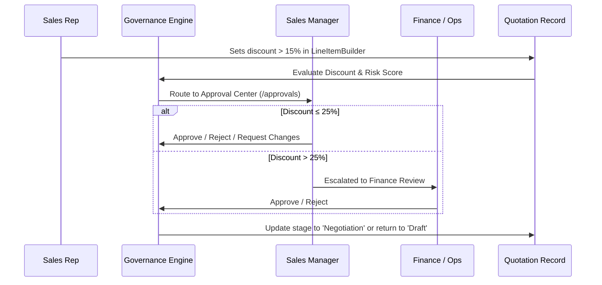

# Phase 4: Multi-Tier Approval Workflow Matrix & Commercial Governance

Phase 4 implemented the complete **Discount Governance & Approval Center** module (`/approvals` and `/approvals/:id`), enforcing organizational compliance across commercial discounts and deal margins.

---

## 🛡️ Governance Escalation Matrix

Commercial exceptions are automatically evaluated against the governance threshold matrix configured in [`src/context/ApprovalContext.jsx`](file:///f:/odoo-dealflow/myapp/src/context/ApprovalContext.jsx):

```text
Quotation Discount Depth:
  0% — 15%   ──>  Auto-Approved (No management action needed)
 15% — 25%   ──>  Sales Manager Review Required (Medium Risk: 30-60)
 > 25%       ──>  Finance / Operations Dual Review (High Risk: > 60)
```

### Risk Scoring Model
A dynamic risk score (0-100) is generated for each quotation based on:
1. **Discount Depth**: Proportional score penalty for every percentage point beyond 10%.
2. **Gross Margin Impact**: High penalties if total gross margins dip below 20%.
3. **Customer Credit Rating & Deal Velocity**: Adjustments based on tier (Platinum, Gold, Silver).

---

## 🔄 The Approval Workflow



---

## 📄 Key Pages & Components

### 1. Approval Center (`/approvals` — [`src/pages/Approvals.jsx`](file:///f:/odoo-dealflow/myapp/src/pages/Approvals.jsx))
- **KPI Metrics**: `Pending Reviews`, `High Risk Requests`, and `Total Value Pending` formatted in Indian Rupees (INR ₹).
- **Search & Filters**: Multi-criteria search by Approval ID, Quote ID, Customer Name, or Sales Rep; status filters (`Pending`, `Approved`, `Rejected`, `Changes Requested`).
- **Review List**: Tabular ledger with risk score badges, discount differential, and quick action buttons.

### 2. Approval Detail & Decision Drawer (`/approvals/:id` — [`src/pages/ApprovalDetail.jsx`](file:///f:/odoo-dealflow/myapp/src/pages/ApprovalDetail.jsx))
- **Discount Comparison Panel**: Side-by-side view of requested discount vs company threshold.
- **Deal Financials Summary**: Subtotal, discount amount, GST (18%), and net payable total.
- **Audit Decision Trail**: Timeline log of all comments, re-submissions, and reviewer verdicts.
- **Action Triggers**:
  - `Approve Request`: Marks approval as Approved and advances quotation to `Negotiation`.
  - `Request Changes`: Sends quote back with required revisions.
  - `Reject Request`: Rejects exception and blocks deal advancement.
